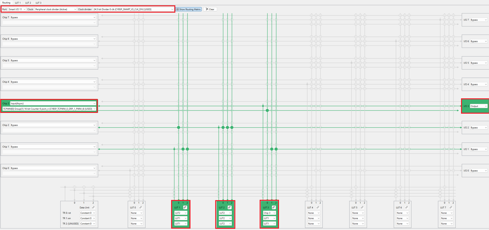

[Click here](../README.md) to view the README.

## Design and implementation

The design of this application is minimalistic to get started with code examples on PSOC&trade; Edge MCU devices. All PSOC&trade; Edge E84 MCU applications have a dual-CPU three-project structure to develop code for the CM33 and CM55 cores. The CM33 core has two separate projects for the secure processing environment (SPE) and non-secure processing environment (NSPE). A project folder consists of various subfolders, each denoting a specific aspect of the project. The three project folders are as follows:

**Table 1. Application projects**

Project | Description
--------|------------------------
*proj_cm33_s* | Project for CM33 secure processing environment (SPE)
*proj_cm33_ns* | Project for CM33 non-secure processing environment (NSPE)
*proj_cm55* | CM55 project

In this code example, at device reset, the secure boot process starts from the ROM boot with the secure enclave (SE) as the root of trust (RoT). From the secure enclave, the boot flow is passed on to the system CPU subsystem where the secure CM33 application starts. After all necessary secure configurations, the flow is passed on to the non-secure CM33 application. Resource initialization for this example is performed by this CM33 non-secure project. It configures the system clocks, pins, clock to peripheral connections, and other platform resources. It then enables the CM55 core using the `Cy_SysEnableCM55()` function and the CM55 core is subsequently put to DeepSleep mode.

This design consists of a PWM resource and a smart I/O resource, both creating square waves of slightly different frequencies. These square waves are routed through an exclusive-OR (XOR) gate within the smart I/O resource, yielding a signal with a gradually changing duty cycle. The rate of change is proportional to the difference between the output square wave frequencies. The signal is then output to IO1 of smart I/O port. Driving an LED with this signal results in a ramping effect, where the LED gradually gets brighter and dimmer alternately.

The PWM is driven by a 20 kHz clock with a period of 399 counts and a compare value of 200 counts, which gives a 50 percent duty cycle square wave with a 20 ms period. The smart I/O is clocked at 198 Hz using a divided clock sourced from CLK_PERI. This input clock is divided by four using the lookup tables (LUTs) of the smart I/O resource to produce a square wave with a 20 ms period.

To generate a square wave signal with a time period close to 20 ms, a 198 Hz clock is divided by four using a synchronous sequential circuit, which is realized using the LUTs of the smart I/O resource.

To implement a divide-by-4 sequential circuit, consider the state transition values shown in **Table 2**.

**Table 2. State transition table for a divide-by-4 sequential circuit**

Clock |  Q0(n)|  Q1(n)|Q0(n+1)|Q1(n+1)|  D0 |  D1
---------|------ |------ | ------| ------| ----| ----
&uparrow;|  0    |   0   |   1   |  1    |  1  |  1
&uparrow;|  1    |   1   |   0   |  1    |  0  |  1
&uparrow;|  0    |   1   |   1   |  0    |  1  |  0
&uparrow;|  1    |   0   |   0   |  0    |  0  |  0

 

From this state transition table (**Table 2**), you can observe that Q0 is half the frequency of Clk_SmartIO and Q1 is 1/4th the frequency of Clk_SmartIO. This sequential logic can be implemented using the LUTs of the smart I/O resource.

**Figure 1** shows the implementation of this logic using LUT 2 and LUT 3. In addition, the divided clock is XORed with the PWM output using LUT1 to generate a signal with the duty cycle gradually increasing and decreasing over time. The output of LUT1 is driven to IO1 output.

**Figure 1. LUT configuration and timing diagram**

**Figure 2** highlights the custom design settings for the TCPWM.

**Figure 2. TCPWM configuration**

**Figure 3** through **Figure 4** illustrate the steps for configuring smart I/O.

**Figure 3. Enabling smart I/O**

**Figure 4. Smart I/O routing configuration**

**Figure 5** shows LUT2 configuration settings. Similarly, you can configure LUT1 and LUT3 settings.

**Figure 5. LUT configuration**

**Figure 6** and **Figure 7** show the peripheral clock configuration for smart I/O and TCPWM resources respectively.

**Figure 6. Peripheral clock configuration for smart I/O**

**Figure 7. Peripheral clock configuration for TCPWM**

 